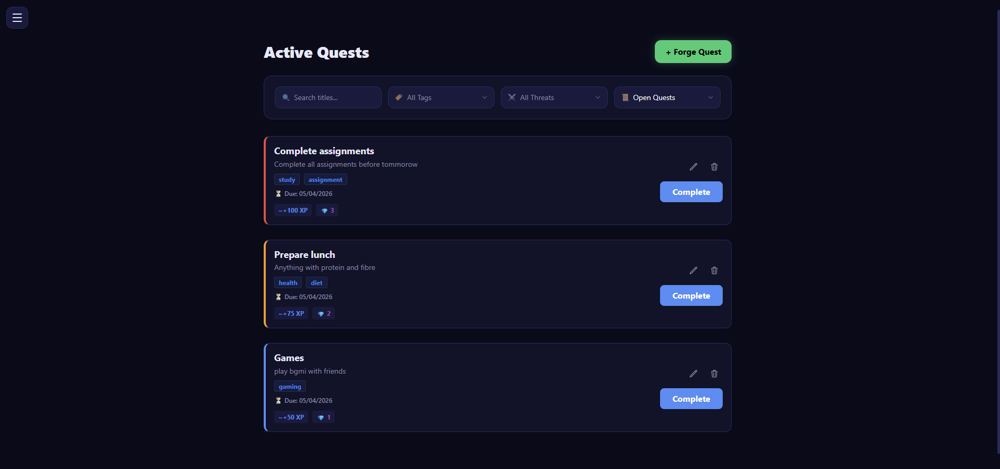

<div align="center">

# ⚔️ Workspace — Gamified Productivity App

<p align="center">
  
  
  
  
  
</p>

A full-stack productivity application that applies RPG game mechanics to task management and Pomodoro focus sessions. Built to solve the retention problem in standard productivity tools — most apps get abandoned because completing a task feels like work, not progress. Workspace makes consistency feel rewarding by turning daily habits into a competitive game.

🔗 **[Live Demo](https://task-tracker-full-stack-sigma.vercel.app/)** &nbsp;·&nbsp;
💻 **[Repository](https://github.com/HarshvardhanRokade/Task_Tracker_Full_Stack)**

> **Demo credentials:** `newbie_user` / `Password123!`

</div>

---

## 📸 Screenshots

| 🏆 Leaderboard | 👤 Public Profile | 📊 Analytics Dashboard |
|:---:|:---:|:---:|
|  |  |  |

| 📝 Active Quests | 🍅 Focus Timer | 💎 The Tavern |
|:---:|:---:|:---:|
|  |  |  |

---

## 🏗️ Architecture Overview

### ⚙️ The Engine Layer — The Most Important Design Decision

The gamification math lives in three pure Java classes with **zero Spring annotations and zero database access**:

| Engine | Responsibility |
|---|---|
| `XpEngine` | XP calculation, leveling, multi-level jumps, additive multipliers |
| `StreakEngine` | Daily streak rules, freeze consumption, night owl grace period |
| `FlowEngine` | Pomodoro flow multiplier, pause tier evaluation, session validity |

These classes are independently unit testable in milliseconds without spinning up a Spring context or connecting to a database. Any bug in XP calculation is caught by a unit test before it ever touches the web layer.

```bash
# Run gamification engine unit tests
./mvnw test
```

### 🔐 Two-Token JWT Authentication
Access token  — 15 minutes · Zustand memory only · Never touches disk
Refresh token — 7 days · HttpOnly cookie · SHA-256 hashed in database

Every refresh **rotates** the token and revokes the old one. If a stolen refresh token is replayed after the legitimate user has already refreshed, the backend detects a revoked token being reused, immediately revokes **all sessions** for that user, and forces re-login. The attack window is limited to one token lifetime.
